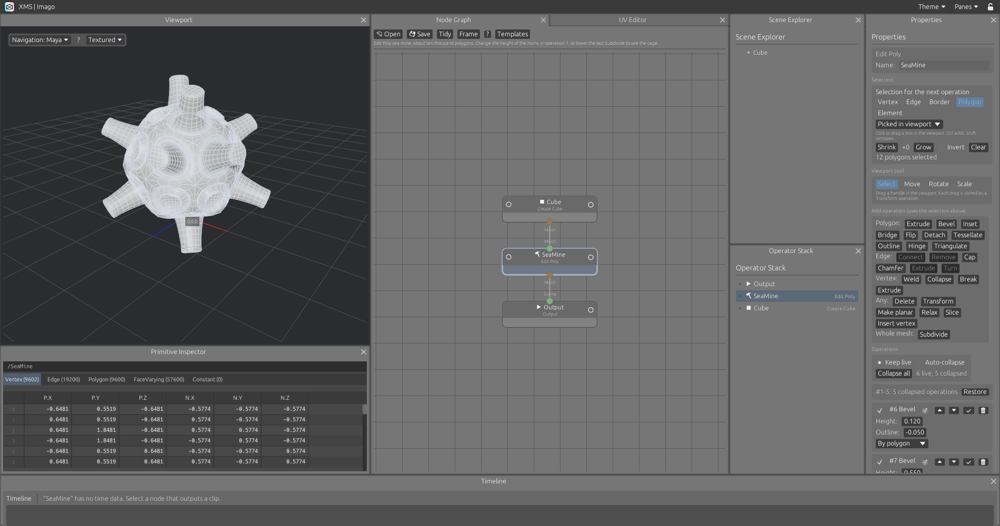
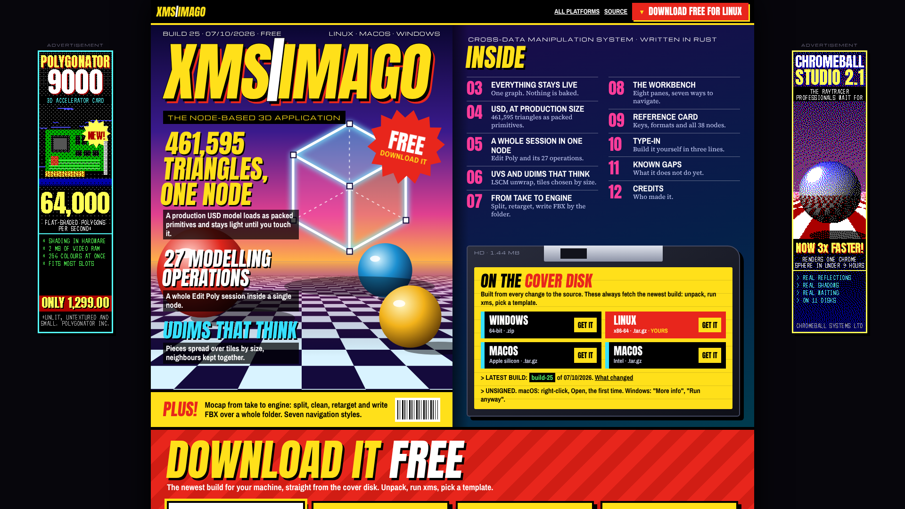
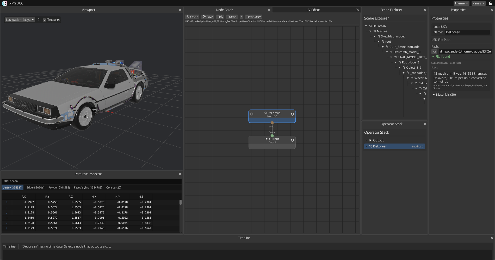
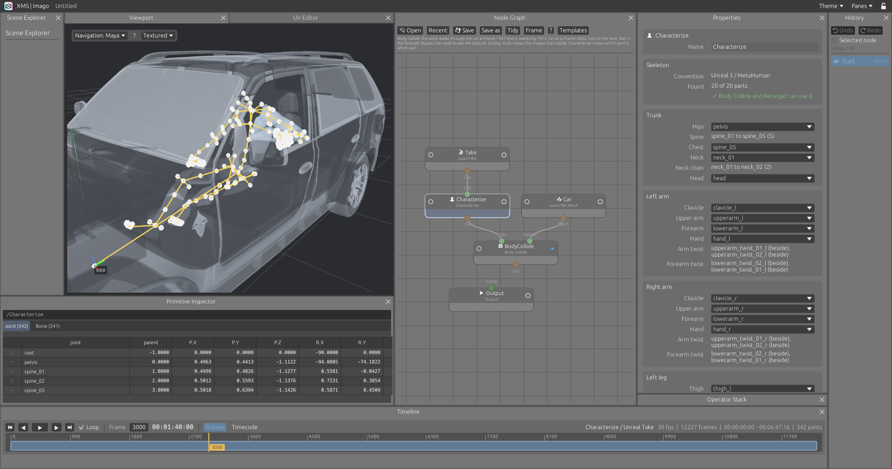
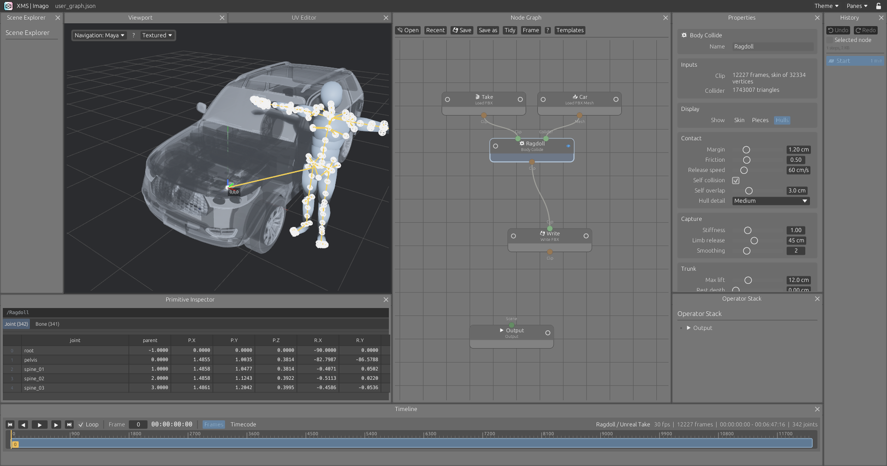
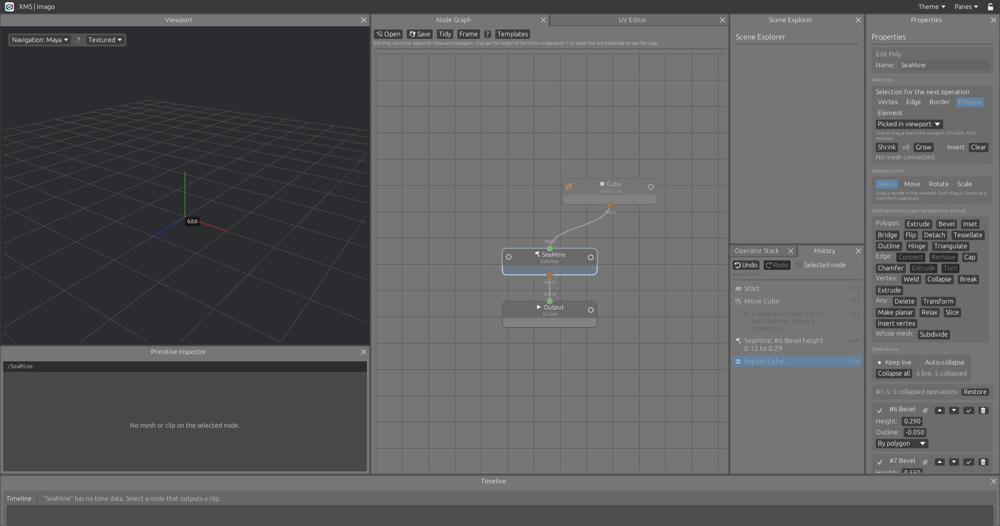

# XMS | Imago

**A node-based 3D application written in Rust.** Model, import, animate and export, with every step a node you can go back and change.

Created by [Martino Madeddu](https://github.com/MartinoMadeddu). Additional development by [Simon Legrand](https://github.com/srlegrand).

**[xms | imago website](https://martinomadeddu.github.io/xms-imago/)** · **[Download a build](https://github.com/MartinoMadeddu/xms-imago/releases)** for Linux, macOS or Windows, pick a template, and start changing numbers.

## About

A work in progress, started as a way of learning Rust. Big chunks of the project, sometimes entire modules, were written with AI and will be replaced moving forward.

## Everything stays live

Nothing is baked. A mesh is a cube node followed by the operations that shaped it. A mocap clip is a file node followed by the trims, renames and retimes applied to it. Change any value upstream and everything after it follows.

Thirty templates ship with the program, one for each area of it, in two parts: Martino's (composed USD stages: composition, curves and points, point instancers, native instances, purposes; ICE) and Simon's (modelling, UV, USD models, animation and mocap). Each loads a working graph and tells you what to try.

## Polygon modelling in a single node

Edit Poly keeps a whole modelling session in one node, modelled on the Edit Poly modifier of 3ds Max.

- **Five selection levels:** vertex, edge, border, polygon, element. Pick in the viewport, or select by rule so the selection adapts when the mesh changes
- **Twenty-seven operations:** extrude (polygon, edge, vertex), bevel, inset, outline, hinge, chamfer, slice, bridge, connect, weld, collapse, cap, detach, tessellate, triangulate, turn, relax, subdivide and more
- **Soft selection:** a falloff distance on Transform
- **Manipulators:** move, rotate and scale in the viewport on Q, W, E, R. Each drag becomes an operation you can edit afterwards
- **Collapse when you are done:** freeze operations one by one or all at once, or let the node collapse them as you go. Collapsed operations still follow the mesh coming in

## UV unwrapping

- **UV Unwrap:** cuts the mesh into charts where the surface bends past an angle, flattens each chart with least squares conformal maps (Lévy, Petitjean, Ray and Maillot, 2002) and packs the charts into the unit square. Box and planar projection are there too
- **UDIM tiles:** set a tile count and the separate pieces of the mesh are spread over them. Pieces close together share a tile, and the most surface goes to 1001
- **UV Transform and UV Edit:** move, turn, scale and flip the whole layout or single islands
- **UV Editor pane:** the layout of the selected node, with zoom, pan and island dragging

## USD, at production size

- **Composed stages:** sublayers, references, payloads, inherits, specializes and variants, in text and binary files, resolved as usdview would
- **Packed primitives:** one piece per mesh, curves or points prim, in its own space with every primvar, placed by its transform and passed along without copying
- **Instancing kept:** native instances and point instancers hold each prototype once. Moving a forest moves matrices, and the viewport draws thousands of copies in one call
- **Light by default:** the Scene Explorer drives the viewport, as in Gaffer. Closed prims are boxes, opening one shows what is inside, and guide, proxy and render purposes switch on and off
- **Pick, then edit:** Pick Primitives chooses pieces by path pattern. Transform, Edit Poly, the UV nodes and ICE then work on those, each piece staying itself, and pass the rest through
- **Write it back:** Write USD saves what the network changed as an override layer over the original file. Only what changed is written, and the layer opens on its own in usdview or rray
- **Materials and textures in the viewport**, straight from the `.usdz`
- **What is in the file:** materials, cameras, skeletons and lights are listed on the node, along with what is not read yet
- **UVs from the file**, shown in a UV editor that draws a million edges

## Motion capture, from take to engine

Load a folder of FBX takes, split the characters, fix the pose, skin a proxy and write the files your engine wants, in one graph that runs over the whole folder.

- **Real frame rates and timecode:** rational rates, drop-frame, and a timeline that takes its range from whichever node is selected
- **Clip nodes:** rename joints, trim, retime, set timecode
- **Clip tools:** mirror, smooth, in place, blend, loop, retarget, time warp, prune joints, floor
- **Any human skeleton:** Unreal, MetaHuman, Mixamo, HumanIK, Biped, Rigify, Unity, VRM, VRoid, Character Creator, Daz, SMPL, Xsens, OptiTrack, Rokoko, ARKit, Kinect, CMU and more are read from their joint names, with their twist joints in line or beside the limb. A Characterize node shows what was read and sets the rest by hand. Retarget matches joints by the part of the body they are, so a Mixamo take drives an Unreal skeleton
- **One Transform for everything:** the node that moves a mesh or a USD asset moves a clip too, by its top joints, so a skinned mesh moves once, with its skeleton
- **Name patterns, not typing:** nodes that work on joints by name take comma-separated regular expressions, with a picker listing the joints coming in and a live match count
- **Batch nodes:** split characters, auto T-pose, fix pose, proxy skin, write FBX
- **Write FBX, the skeleton it came in with:** after any process, a clip goes back out with the source file's joint names, hierarchy, Root and LimbNode kinds, axes and unit, so an engine sees an animation of the skeleton it already has. Motion only, or with the mesh, skin and bind pose. One file or the whole folder, in the background

## Body Collide: a capture that respects the set

The actor sat on a box. The character sits in a car, with its hips in the cushion and its feet under the floor. Wire the take and the set into a Body Collide node and press Solve: the character is kept out of the set and out of itself, joints give way as far as each may, and no bone changes length. Where the capture walks the character through a door that was not there on the day, it follows the capture through and is caught again on the other side.

The result then goes through a human IK pass: elbows and knees bend about their hinge the way round the capture bends them, never past what a human joint does, pointing near where the capture points them; wrists and ankles stay within their range; twist joints take their share. On the template's take no elbow or knee is left bent the wrong way (8 frames before the pass) and no wrist or ankle past its range; wrists and ankles stay within 2.4 cm of where the solve put them.

A take of 12,227 frames against a car of 1.7 million triangles solves in about five minutes on two cores, a chunk of frames at a time. The "Body Collide: into the car" template ships with that take, the car and the solved result, so it opens solved. Display on the node shows the character's skin, its rigid pieces, or the hulls that collide. See [docs/body-collide.md](docs/body-collide.md).

## Undo, with a history you can see

Ctrl+Z and Ctrl+Shift+Z undo and redo everything in the scene: nodes, parameters, Edit Poly operations, wires, names, bypass, node positions. The camera, the layout and the selection are not part of it, so undo never moves your view.

- **One step per gesture:** a slider dragged over two hundred frames is one step, made when the mouse is let go
- **Named from what changed:** "SeaMine: #6 Bevel height 0.12 to 0.29", "Connect Cube to SeaMine", "Template: Edit Poly: sea mine". Nobody writes the names; they come from the difference
- **History pane:** every step, the current one marked. Click any step to go there
- **Nothing is lost:** undo, then change something, and the undone steps stay as a branch you can go back to
- **Picks fold in:** picking polygons and extruding them is one step
- **Cheap:** a step stores only the nodes that changed. Pin a step to keep it whatever the memory

## An interface that gets out of the way

- **Bypass any node:** the ring at the left of a node switches it off and passes its input through

- **Dock anything anywhere:** every pane is a tab. Drag it beside another pane, stack it, float it, or drop it on a side of the window to span that whole side
- **Lock it:** one padlock freezes the layout once you are happy. Dividers still resize
- **Frame it:** F, G, Z or . frames the selection, down to selected vertices, edges and polygons. A or H frames everything
- **Your navigation:** Maya, Houdini, XSI, Blender, Max, Modo or Unreal viewport controls, from a menu
- **Remembered:** layout, floating windows, theme and navigation style come back at the next start
- **Copy and paste nodes:** Ctrl+C and Ctrl+V, with their wires and ICE trees, between windows and from one session to the next
- **Add instead of open:** the + beside Open, a recent file or a template adds it to the graph open
- **Files:** Open, Recent (the last ten), Save, Save as, Ctrl+S. The top bar shows the file and whether it is saved; closing with unsaved changes asks first
- **Fast:** the graph is cooked when its content changes, not on every frame
- **Three themes, all editable:** Light, Dark, and ADHD (dark blues, with orange for whatever is selected or active). A colour editor changes any of them
- **Layouts as files:** save a layout, load it back, pass it to someone else
- **One add menu:** seven categories, each a submenu; every node has one name, the same in the menu, on the node and in its properties
- **Properties that line up:** every node laid out the same way, labels in one column, values filling the other, explanations in tooltips
- **A tidy graph:** templates load laid out and framed, "Tidy" does the same to your own graph, and a right-click on an output adds the next node under it, already wired
- **Compact lists:** the operator stack stays in one column however long the chain is

## Also in the box

- Cube, sphere and grid primitives, Transform, Merge
- Scatter Points and Copy To Points
- ICE trees: graphs inside a node, in an editor modelled on Softimage ICE (typed ports and wires, collapsible nodes, zoom, pan and frame, ↓ and ↑ to go in and out). A tree runs on each packed primitive in its own space
- Primitive Inspector: a spreadsheet of the selected node. Vertex, Edge, Polygon, FaceVarying and Constant tabs for a mesh, Joint and Bone tabs for a clip
- Graphs saved and loaded as JSON

## Get it

**Download:** binaries for Linux, macOS and Windows are built from every change to `main` and published on the [Releases page](https://github.com/MartinoMadeddu/xms-imago/releases). See [docs/releases.md](docs/releases.md).

**Build from source:**

    cargo run --release

On Ubuntu or Debian, first:

    sudo apt install build-essential pkg-config libasound2-dev libudev-dev libx11-dev libxkbcommon-x11-0

## Documentation

[docs/](docs/README.md): interface, undo, templates, Edit Poly, UV, USD, geometry, viewport navigation, animation and mocap, Body Collide, builds and releases.

## Contributing

XMS | Imago is Martino Madeddu's project: other work builds on his and does not overwrite it. Read [DESIGN_PHILOSOPHY.md](DESIGN_PHILOSOPHY.md) first: how the program should work and why. Add to it when a decision is made, and update the README and the pages in `docs/` with every change.

Working with an AI assistant: [LLM_instructions.md](LLM_instructions.md) lists what it should check (workspace, build, GitHub access, settings) and the loop changes go through: the assistant sends a patch made on top of `main`, you download it and run one block of commands that applies, runs, commits and pushes it.

## Not done yet

- Undo inside ICE subnets, and history saved with the graph
- Edit Poly: interactive cut and quickslice, extrude along spline, target weld, attach, smoothing groups, material IDs, paint deformation, constraints
- USD: normal and roughness maps in the viewport, cameras, animation and skinning, per-face material subsets, writing time samples and edits inside instances
- UV: editing single UV vertices and edges, a checker in the viewport, UVs kept through Edit Poly and Copy To Points, UVs in FBX files. Unwrapping is LSCM only: ABF++, SLIM and BFF are not implemented
- Mocap: IK in Retarget, foot planting
- Timeline zoom and pan
- Curve cleanup
- ICE subnet contents in saved graphs (copied nodes carry them)
- Copy and paste inside an ICE tree: Ctrl+C and Ctrl+V work on the scene network only
- The program icon inside the file itself (Windows Explorer, macOS dock). The window and task bar icon is set on X11 and Windows
- Viewport interaction has been tested with simulated input, not yet thoroughly by hand
- Import into Unreal has not been tried here. Written files are compared with their source FBX bone for bone (names, parents, kinds, axes, unit, local values), on a MetaHuman take

## Example files

- `examples/DeLorean.usdz` is by VTX (https://sketchfab.com/VTX_car), under CC BY-NC-SA 4.0, included with the permission of its author. See `examples/CREDITS.md`.
- `examples/ragdoll/` holds Simon Legrand's take and car for the Body Collide template, in the program's compact `.xmsclip` and `.xmsmesh` formats, with the solved result. `examples/ragdoll/split/into_the_car_.fbx` is frames 1200 to 9199 of the take as FBX. See [examples/ragdoll/README.md](examples/ragdoll/README.md).

## Credit

XMS was created by [Martino Madeddu](https://github.com/MartinoMadeddu): the node graph, the viewport, the ICE subnets, the USD loader and composed stages, GPU instancing and the look of the interface.

Additional development by [Simon Legrand](https://github.com/srlegrand): polygon modelling, UV, USD at production size, motion capture, Body Collide, the dockable interface and the website.

