# XMS DCC

**A node-based 3D application written in Rust.** Model, import, animate and export, with every step a node you can go back and change.

This is Simon Legrand's fork of [MartinoMadeddu/xms-imago](https://github.com/MartinoMadeddu/xms-imago), the project Martino Madeddu started. It adds polygon modelling, UV unwrapping, motion capture tools and a dockable interface on top of his node graph.

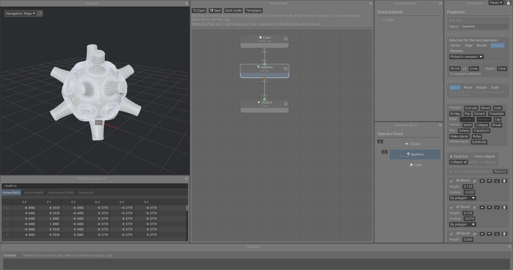

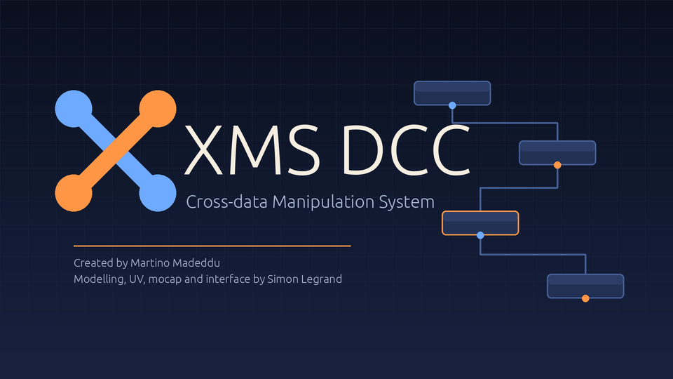

**[Download a build](https://github.com/srlegrand/dcc-xms/releases)** for Linux, macOS or Windows, pick a template, and start changing numbers.

## Everything stays live

Nothing is baked. A mesh is a cube node followed by the operations that shaped it. A mocap clip is a file node followed by the trims, renames and retimes applied to it. Change any value upstream and everything after it follows.

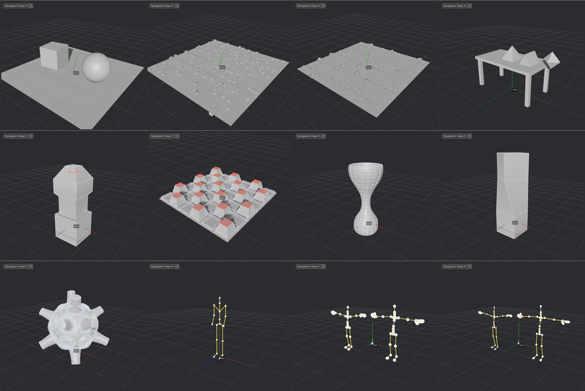

Twenty-three templates ship with the program, one for each area of it. Each loads a working graph and tells you what to try.

## Polygon modelling in a single node

Edit Poly keeps a whole modelling session in one node, modelled on the Edit Poly modifier of 3ds Max.

- **Five selection levels:** vertex, edge, border, polygon, element. Pick in the viewport, or select by rule so the selection adapts when the mesh changes
- **Twenty-seven operations:** extrude (polygon, edge, vertex), bevel, inset, outline, hinge, chamfer, slice, bridge, connect, weld, collapse, cap, detach, tessellate, triangulate, turn, relax, subdivide and more
- **Soft selection:** a falloff distance on Transform
- **Manipulators:** move, rotate and scale in the viewport on Q, W, E, R. Each drag becomes an operation you can edit afterwards
- **Collapse when you are done:** freeze operations one by one or all at once, or let the node collapse them as you go. Collapsed operations still follow the mesh coming in

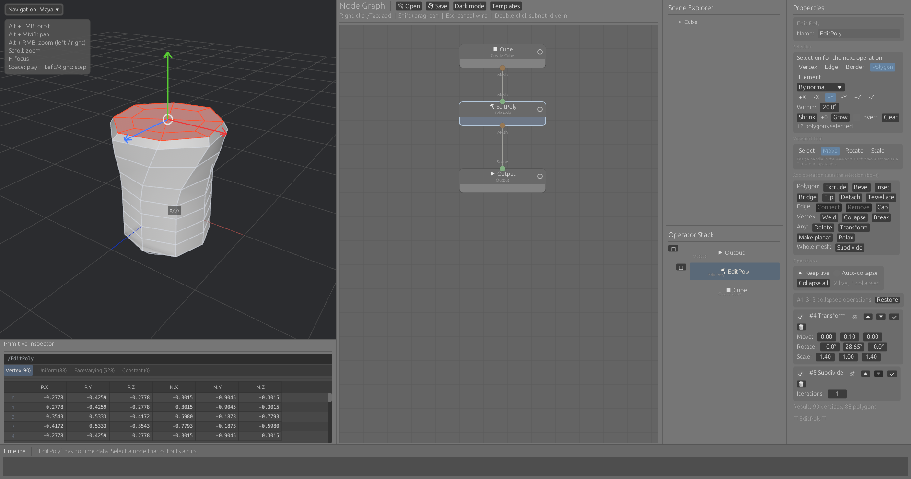

## UV unwrapping

- **UV Unwrap:** cuts the mesh into charts where the surface bends past an angle, flattens each chart with least squares conformal maps (Lévy, Petitjean, Ray and Maillot, 2002) and packs the charts into the unit square. Box and planar projection are there too
- **UDIM tiles:** set a tile count and the separate pieces of the mesh are spread over them. Pieces close together share a tile, and the most surface goes to 1001
- **UV Transform and UV Edit:** move, turn, scale and flip the whole layout or single islands
- **UV Editor pane:** the layout of the selected node, with zoom, pan and island dragging

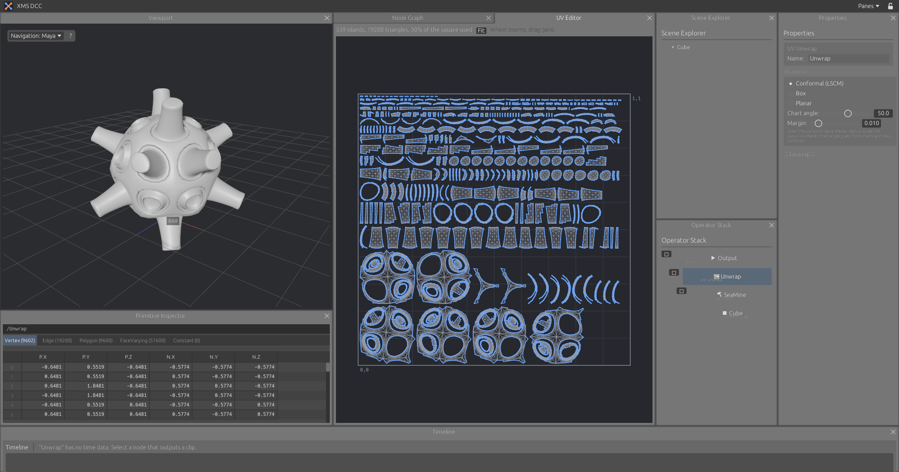

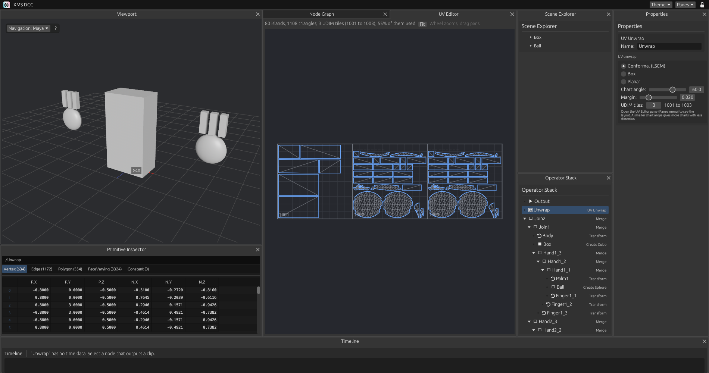

## USD, at production size

- **Packed primitives:** a USD file comes in as one piece per mesh prim, passed along without copying. A 460,000 triangle model stays light until you touch part of it
- **Pick, then edit:** Pick Primitives chooses pieces by path pattern. Edit Poly, Transform and the UV nodes then work on those and pass the rest through
- **A full transform stack:** every `xformOp`, in order, with units and up axis converted
- **What is in the file:** materials with their textures, cameras, skeletons and lights are listed on the node, along with what is not read yet
- **UVs from the file**, shown in a UV editor that draws a million edges

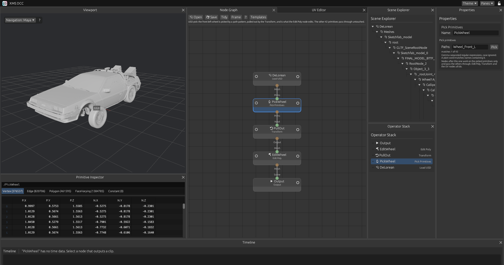

## Motion capture, from take to engine

Load a folder of FBX takes, split the characters, fix the pose, skin a proxy and write the files your engine wants, in one graph that runs over the whole folder.

- **Real frame rates and timecode:** rational rates, drop-frame, and a timeline that takes its range from whichever node is selected
- **Clip nodes:** rename joints, trim, retime, set timecode
- **Clip tools:** mirror, smooth, in place, transform, blend, loop, retarget, time warp, prune joints, floor
- **Name patterns, not typing:** nodes that work on joints by name take comma-separated regular expressions, with a picker listing the joints coming in and a live match count
- **Batch nodes:** split characters, auto T-pose, fix pose, proxy skin, write FBX
- **Write FBX:** skeleton, animation, mesh, skin and bind pose, for one file or the whole folder, in the background

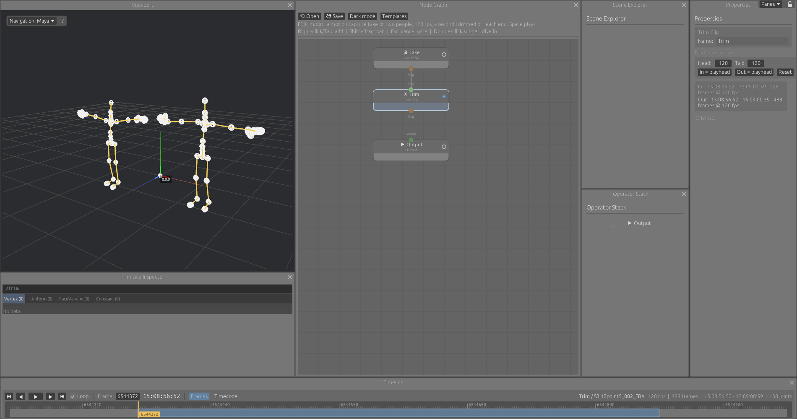

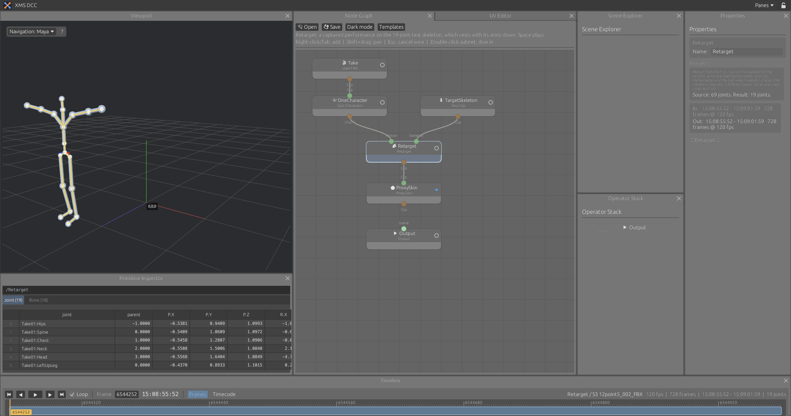

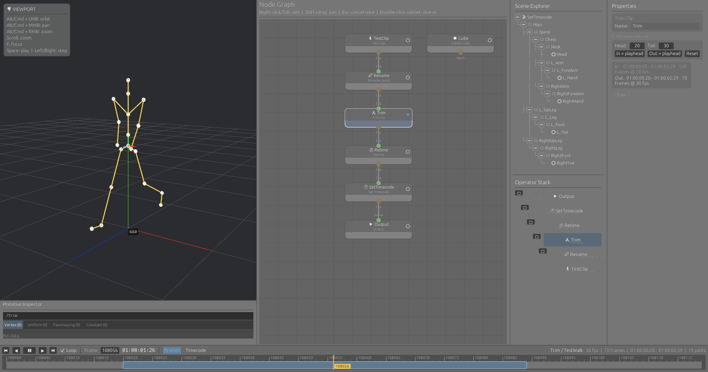

## An interface that gets out of the way

- **Bypass any node:** the ring at the left of a node switches it off and passes its input through

- **Dock anything anywhere:** every pane is a tab. Drag it beside another pane, stack it, float it, or drop it on a side of the window to span that whole side
- **Lock it:** one padlock freezes the layout once you are happy. Dividers still resize
- **Frame it:** F, G, Z or . frames the selection, down to selected vertices, edges and polygons. A or H frames everything
- **Your navigation:** Maya, Houdini, XSI, Blender, Max, Modo or Unreal viewport controls, from a menu
- **Remembered:** layout, floating windows, theme and navigation style come back at the next start
- **Fast:** the graph is cooked when its content changes, not on every frame
- **Three themes, all editable:** Light, Dark, and ADHD (dark blues, with orange for whatever is selected or active). A colour editor changes any of them
- **Layouts as files:** save a layout, load it back, pass it to someone else
- **A tidy graph:** templates load laid out and framed, "Tidy" does the same to your own graph, and a right-click on an output adds the next node under it, already wired
- **Compact lists:** the operator stack stays in one column however long the chain is

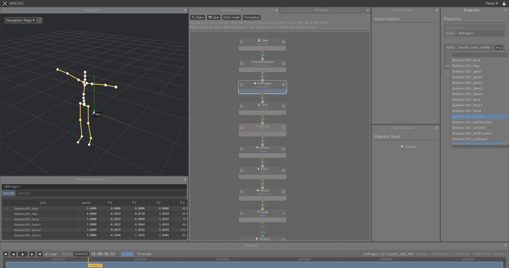

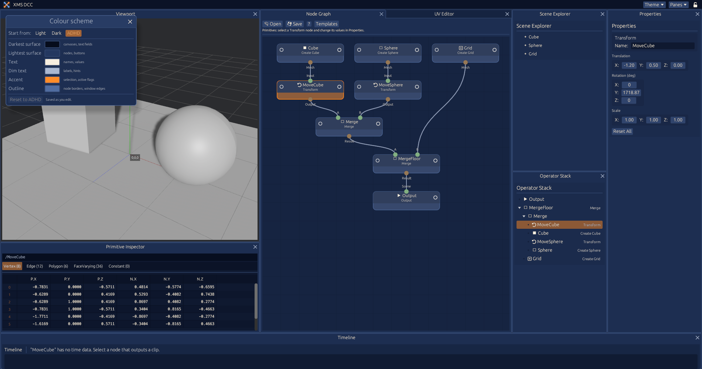

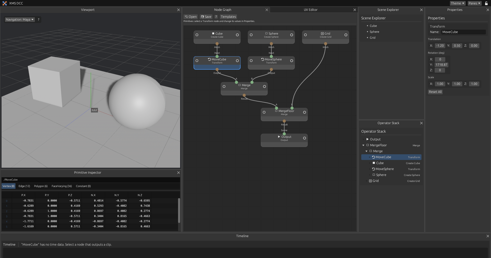

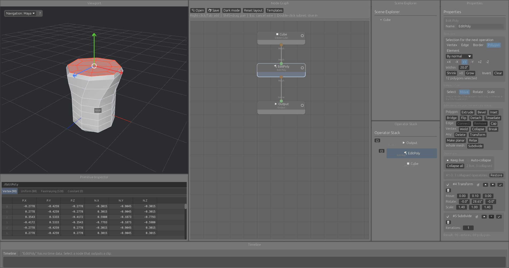

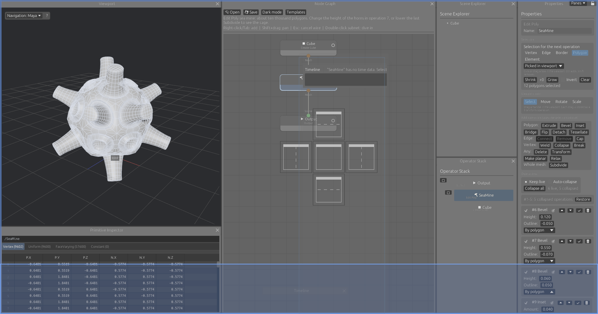

## Also in the box

- Cube, sphere and grid primitives, Transform, Merge
- Scatter Points and Copy To Points
- ICE-style subnets: graphs inside a node
- Primitive Inspector: a spreadsheet of the selected node. Vertex, Edge, Polygon, FaceVarying and Constant tabs for a mesh, Joint and Bone tabs for a clip
- Graphs saved and loaded as JSON

## Get it

**Download:** binaries for Linux, macOS and Windows are built from every change to `main` and published on the [Releases page](https://github.com/srlegrand/dcc-xms/releases). See [docs/releases.md](docs/releases.md).

**Build from source:**

    cargo run --release

On Ubuntu or Debian, first:

    sudo apt install build-essential pkg-config libasound2-dev libudev-dev libx11-dev libxkbcommon-x11-0

## Documentation

[docs/](docs/README.md): interface, templates, Edit Poly, UV, USD, viewport navigation, animation and mocap, builds and releases.

## Not done yet

- Undo
- Edit Poly: interactive cut and quickslice, extrude along spline, target weld, attach, smoothing groups, material IDs, paint deformation, constraints
- USD: materials and textures in the viewport, cameras, animation and skinning, references to other files, instancing, writing USD
- UV: editing single UV vertices and edges, a checker in the viewport, UVs kept through Edit Poly and Copy To Points, UVs in FBX files. Unwrapping is LSCM only: ABF++, SLIM and BFF are not implemented
- Mocap: IK, foot planting, characterization
- Meshes and skinning read from FBX
- Timeline zoom and pan
- Curve cleanup
- ICE subnet contents in saved graphs
- The program icon inside the file itself (Windows Explorer, macOS dock). The window and task bar icon is set on X11 and Windows
- Viewport interaction has been tested with simulated input, not yet thoroughly by hand
- Import into Unreal has not been tested. Written files were checked by reading them back and against a reference script, on one OptiTrack Motive take

## Example files

The USD model in `examples/DeLorean.usdz` is by VTX (https://sketchfab.com/VTX_car), under CC BY-NC-SA 4.0: it may not be used commercially. See `examples/CREDITS.md`.

## Credit

XMS was created by [Martino Madeddu](https://github.com/MartinoMadeddu). The node graph, the viewport, the ICE subnets, the USD loader and the look of the interface are his. The first animation work from this fork was merged upstream in [pull request #3](https://github.com/MartinoMadeddu/xms-imago/pull/3); the rest is proposed in [pull request #4](https://github.com/MartinoMadeddu/xms-imago/pull/4).

---

## Original README

WIP 3d application written in Rust as part of learning the language -
The project currently has big chunks and sometimes entire modules written with AI which will be replaced moving forward.

XMS (Cross-data Manipulation System ) UI sccreengrab

