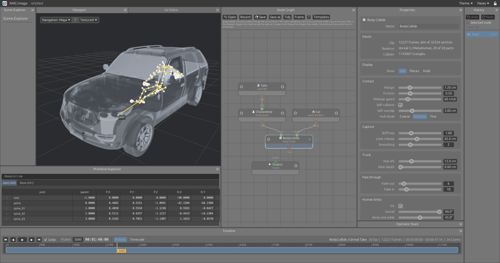

# Body Collide: collision cleanup for motion capture

A captured performance does not know about the set. The actor sat on a box, the character sits in a car, and the hips are in the cushion, the feet under the floor and a forearm through a thigh. The Body Collide node keeps the character out of a collider mesh and out of itself, and changes the capture as little as that takes. Underneath it is a ragdoll: a rigid body per bone, joined at the joints.

## The nodes

| Node | Menu | Does |
|---|---|---|
| Load FBX Mesh | File | Reads every mesh of an FBX file, where it stands, as packed primitives. For the set. |
| Characterize | Mocap | Says which joint is which part of a human. Read from the names for the common conventions, set by hand for the rest. Optional before Body Collide. See [Skeletons](mocap.md#skeletons-and-characterize). |
| Body Collide | Mocap | First input a clip, second input a collider mesh. Puts out the clip, kept out of the collider, within what a human body can do. |

**Display** in the node's properties chooses what the viewport draws of the character: its **Skin**, the skin cut into rigid **Pieces**, one per body, or the convex **Hulls** the solver collides. It changes the drawing only: the node puts out the clip with its skin either way. Graphs saved with the old Calamari node open with that node gone and its choice moved here.

Load FBX now reads a mesh bound to the skeleton, with its weights, and the viewport draws it bending with the joints. Write FBX writes the weights back.

Any mesh can be the collider: a model from Load FBX Mesh or Load USD, a cube, anything the mesh nodes make. It does not have to be closed, one-sided or tidy.

## Using it

1. Load the take with **Load FBX** and the set with **Load FBX Mesh**. They must already be lined up: the node moves the character, not the set.
2. Wire the take to the first input of a **Body Collide** node and the set to the second. The Inputs group says which convention the skeleton was read as and how many of its 20 parts were found. If the hips or the limbs are missing, put a **Characterize** node between the take and Body Collide and pick them. Put the view flag on the node. The set is drawn see-through, with the character inside.
3. Press **Solve** in the properties of the node. A bar shows frames done, frames a second and time left. **Stop** stops it.
4. When it is done the node puts out the solved clip. Scrub it. Wire it on to Write FBX like any clip.

The node solves nothing by itself. Until Solve has run for exactly the clip, collider and settings it has, the clip passes through as it came, and the panel says so. Change a setting and the panel says "not solved" again.

## The template

**Body Collide: into the car** is the take this was built on: an actor who walks through a car and sits in it for six minutes. The take, the car and the solved result ship with the program, in `examples/ragdoll`, and the template opens solved, with no wait. Change a setting and it has to be solved again.

As FBX the take is 205 MB and the car 99 MB, more than GitHub takes in one file. They ship in two compact formats of the program's own:

| File | Holds | Size |
|---|---|---|
| `.xmsclip` | Skeleton, every frame, and the skin with its weights. What never moves is written once, rotations in 16 bits a component | 4 MB for the take |
| `.xmsmesh` | Positions and triangles | 15 MB for the car |

Load FBX reads `.xmsclip` and Load FBX Mesh reads `.xmsmesh`, by the extension. The take loads in a sixth of a second this way, against five seconds as FBX. Joint positions differ from the FBX by less than a tenth of a millimetre.

## What it does

**Bodies.** One rigid body per main bone: hips, each joint of the spine and the neck, head, upper arm, forearm, hand, thigh, calf, foot. Which joint is which comes from the skeleton's characterization: read from the joint names and the hierarchy for some twenty conventions (Unreal, MetaHuman, Mixamo, HumanIK, Biped, Rigify, Unity, VRM, VRoid, Character Creator, Daz, SMPL, Xsens, OptiTrack and more, listed in [Skeletons](mocap.md#skeletons-and-characterize)), or set by hand on a Characterize node. Skin on fingers, toes, collar bones, twist and helper joints goes to the body above. A part that comes out far lighter than the rest is not a body either.

**Hulls.** Each body gets the convex hull of its piece of skin: 42, 162 or 642 planes, by its size and the Hull detail setting. A body with no skin, such as the head of a body-only mesh, gets a capsule.

**Following.** Each body is carried along with the capture. With nothing in the way the result is the capture, exactly. A body that was pushed aside comes back at the release speed.

**Contact.** A body is pushed out of the collider no faster than the release speed, and starts being pushed, softly, a margin before it touches. The solver's changes are then evened out over a few frames each side, so a contact is taken up over about five frames and nothing flickers.

**Joints.** Each joint may leave the capture by so much swing and twist, by the part of the body: a spine little, a shoulder a lot. Elbows and knees bend about one axis, square to the plane the two bones make in the clip, and not past the straightest pose the clip holds. Wrists and ankles stay within a human range whatever the capture does: flexion either way, much less from side to side (wrist 75 and 25 degrees, ankle 50 and 25, from where the skin was bound; where the capture goes further, the capture is the limit). A hand, a foot or the head that is pushed keeps its turn: the limb moves, the hand does not spin, a lifted foot stays level. A wrist or ankle at the end of its range turns the hand or foot back, not the forearm or calf: when the forearm took that turn, the elbow went the wrong way round.

**Itself.** Parts of the character are kept out of each other, beyond an allowed overlap. Neighbours along the skeleton and the parts of the trunk are left alone.

**No stretching.** The result is rotations on the same skeleton, and a position for the hips. Every other joint keeps its capture. Bone lengths cannot change.

## Human limits

The solved clip then goes through a human IK pass, arm by arm and leg by leg. The wrist or ankle stays where the solve put it. Each correction is nothing while its limit holds, so a frame the solve left alone is left alone here too.

- **Elbows and knees bend about their hinge, the way round the capture bends them.** Where the solve bent one sideways or backwards, the shoulder or hip first turns the upper bone about its length, up to 50 degrees from the capture for an arm, 35 for a leg. Past that, the elbow or knee goes round the line from shoulder to wrist (hip to ankle) to where it can bend properly. Of the ways that work, the one nearest the solve wins, and the one nearest the last frame.
- **Swivel.** An elbow or knee points no further than Swivel from where it points in the capture.
- **No further than a joint bends.** 150 degrees for an elbow, 155 for a knee.
- **Forearm and calf twist** stay within 30 and 15 degrees of the capture.
- **Wrists and ankles** stay within their range, and no further than Wrist and ankle from the capture.
- **Twist joints** take their share of any change of twist: in line (HumanIK roll joints, Daz twist joints) or beside the limb (Unreal and MetaHuman twist joints, Character Creator, HumanIK leaf joints), by where they sit along the bone.

The pass runs on the result when it is shown, in a second or two for 12,000 frames, and is not part of the solve: changing its settings does not solve again. The group says in how many frames an elbow or knee bent the wrong way and a wrist or ankle went past its range, before and after.

## When it cannot be resolved

**Walking through the set.** Where the capture takes the trunk through a surface, its middle across one or more than half of it behind one, the character cannot be kept out. The solver sees this ahead of time. Collisions fade out before it, the character follows the capture through, and collisions fade in after. The Solve group lists these stretches with their timecode.

**Sunk deep.** The trunk is moved out of the collider by a set distance at most. Sunk deeper than that in the capture, it is moved that far and left in by the rest. A trunk sunk a little in a seat is lifted onto it. One sunk deep is not thrown across the car.

**A limb held too far.** A limb held further from its capture than the limit lets go: its collisions fade out, it returns to the capture, and takes hold again when the capture is clear.

**Anything else.** There is no gravity, no momentum and no stored energy. Each frame starts from the capture and is only pulled back toward it, so nothing can build up. A body whose state is not usable is put back on the capture.

## Long takes

A take is solved 128 frames at a time. For each chunk the capture is asked for those frames and the few after them that are needed to look ahead, the chunk is solved, written to a file, and dropped. The solver holds one chunk whatever the length of the take.

The file holds a rotation per body per frame: about 4 MB for 12,000 frames. It is kept in the cache folder (`~/.cache/xms/ragdoll` on Linux, `Library/Caches` on macOS, `%LOCALAPPDATA%` on Windows) under a name made from the clip, the collider and the settings, so a solve is found again in the next session. Set `XMS_CACHE_DIR` to keep it somewhere else. **Forget** removes it.

The program still holds a clip as a whole once it is loaded, and the solved clip beside it. That is how clips work here, not something the solver adds.

## Settings

| Group | Setting | Default | Does |
|---|---|---|---|
| Display | Show | Skin | What the viewport draws of the character: Skin, Pieces or Hulls |
| Contact | Margin | 1.2 cm | Distance from a surface at which pushing starts |
| | Friction | 0.5 | How much a body pressed into a surface resists sliding along it |
| | Release speed | 60 cm/s | How fast a body is pushed out, and how fast it comes back |
| | Self collision | on | Keep the character out of itself |
| | Self overlap | 3 cm | Convex hulls are fatter than the skin. Less than this is not a collision |
| | Hull detail | Medium | Spacing of the points on the hulls: 3.5, 2.5 or 1.8 cm |
| Capture | Stiffness | 1 | How firmly bodies hold to the capture |
| | Limb release | 45 cm | A limb further than this from its capture lets go |
| | Smoothing | 2 frames each side | 0 turns it off |
| Trunk | Max lift | 12 cm | How far the trunk is moved out at most |
| | Rest depth | 0 cm | A seat gives under a sitter |
| Pass through | Fade out, Fade in | 6, 10 frames | Around a stretch the trunk passes through the set |
| Human limits | On | on | The human IK pass on the result |
| | Swivel | 90° | Furthest an elbow or a knee may point from where it points in the capture |
| | Wrist and ankle | 45° | Furthest a hand or a foot may turn from its capture |

## Measured

On a take of 12,227 frames at 30 fps (a MetaHuman body, 342 joints, 32,334 vertices) against a car of 1,743,007 triangles, on two cores:

| | |
|---|---|
| Loading the take | 5 s |
| Building the triangle tree | 1 s |
| Solving | 311 s, 39 frames a second |
| In or near contact | 10,503 frames |
| Collisions off | 223 frames in two stretches: getting in and getting out |
| Bodies put back on the capture | 0 |
| Human pass | under 4 s |

In the frames before the character reaches the car, the result is the capture to the last digit.

What the human limits changed, on the same take. "Earlier" is the solve that shipped before wrists and ankles had a range in the solver, without the human pass:

| | Capture | Earlier | This solve | After the human pass |
|---|---|---|---|---|
| Frames with an elbow or knee bent the wrong way | | 28 | 8 | 0 |
| Most a hand turns from where the skin was bound, left and right | 114°, 123° | 177°, 127° | 119°, 119° | 108°, 119° |
| Most a foot turns from where the skin was bound | 55°, 56° | 104°, 84° | 60°, 59° | 60°, 56° |
| Most a forearm turns away from its capture | | 174°, 95° | 142°, 86° | 99°, 85° |

Frames in which a part is more than 1 cm inside the car, every fourth frame looked at (3,057):

| | Earlier | This solve | After the human pass |
|---|---|---|---|
| Upper arms | 69 | 69 | 97 |
| Forearms | 114 | 109 | 115 |
| Hands | 63 | 42 | 46 |
| Thighs | 79 | 80 | 80 |
| Calves | 163 | 211 | 223 |
| Feet | 130 | 614 | 616 |

Feet sit in the floor more often than before, mostly by 1 to 3 cm (152 of the 614 deeper than 3 cm, against 96 of 130). The earlier solve laid them flat by turning the ankle up to 104 degrees, which no ankle does. The human pass moves wrists and ankles by at most 2.4 cm (where an elbow or knee bent past 150 degrees), and puts elbows a little back into the set in about 1 frame in 100.

## A take of your own, from the command line

    XMS_RAGDOLL_CLIP=take.fbx XMS_RAGDOLL_SET=set.fbx cargo test real_take -- --ignored --nocapture

## Limits

- The character must be a human. A skeleton whose hips and limbs are not found from its names is refused with a message: set them on a Characterize node.
- Ranges are counted from where the skin was bound, taken as the neutral pose. A skin bound with bent wrists shifts the wrist range by that much.
- The human pass keeps wrists and ankles where the solve put them, and can move an elbow or knee back toward where it points in the capture. It does not look at the collider: an elbow it moves can go back into the set.
- Hulls are convex. A hull bridges the hollow of a hand or the inside of an elbow.
- Hulls are made where the skin was bound and do not change: fingers collide as part of an open hand.
- A hull touches the collider at points spaced by the Hull detail setting. A part of the set thinner than that spacing can slip between them.
- A thin sheet with a free edge has no inside. A body that straddles the edge is judged by which side its joint is on.
- Lifting the hips onto a seat moves the whole character. If the set and the capture disagree by a hand's width, line them up first, or let the trunk rest in the seat.
- The floor is only a collider if it is in the collider mesh.
- No feet planting: a foot lifted onto a floor is not held still on it.
