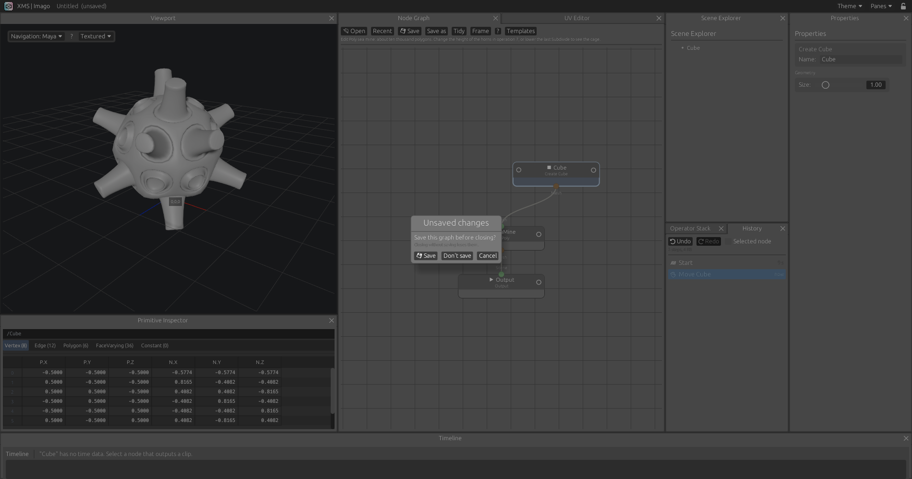
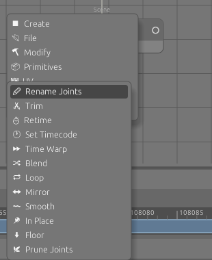
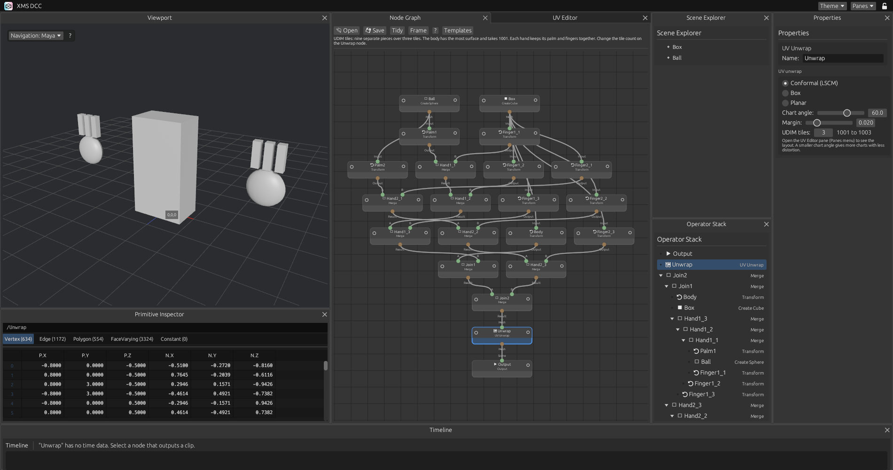

# Interface

## Top bar

A fixed line across the top of the window, for things that belong to the whole program. It holds the logo and the name on the left, the Theme menu, the Panes menu and the layout padlock on the right. It is not a pane: it cannot be moved, floated or closed.

## Panes

Nine panes: Viewport, Node Graph, UV Editor, Scene Explorer, Operator Stack, History, Properties, Primitive Inspector, Timeline. Each one is a tab. The default layout has the Scene Explorer in a narrow column at the left, the Viewport beside it with the UV Editor as a tab behind it (see [UV](uv.md)), and the Primitive Inspector under both; then the Node Graph, then Properties over the Operator Stack. The Timeline runs along the bottom of those, and History (see [Undo](undo.md)) down the whole right side. A layout saved before the History pane existed does not have it: tick it in the Panes menu, or "Reset layout" for this default.

| To | Do this |
|---|---|
| Move a pane | Drag its tab by the title. Drop it on one of the five squares that appear over the pane under the cursor: the middle one stacks it as a tab, the others split that pane on that side |
| Float a pane | Drag its tab and drop it anywhere that is not one of the squares, or double-click the tab |
| Dock along a whole side of the window | Drag the tab to within a few pixels of that side. Blue bars mark the four sides while a tab is dragged, and a blue strip shows where the pane will land. This is how the timeline goes back across the bottom |
| Dock a floating pane | Drag its tab (the title inside the window, not the bar above it) onto one of the squares, or double-click the tab, or use "Dock floating panes" in the Panes menu |
| Move a floating window | Drag the bar at its top |
| Close a pane | The cross on its tab, docked or floating |
| Show a closed pane | Tick it in the Panes menu, in the top bar. It comes back as a tab of the main area |
| Resize | Drag the line between two panes, or the corner of a floating window |
| Start over | "Reset layout" in the Panes menu |
| Keep a layout | "Save layout..." in the Panes menu writes it to a file |
| Bring one back | "Load layout..." in the Panes menu. A file that is not a layout is refused and the current layout stays |

Right-clicking a tab offers the same close and float actions.

### Lock

The padlock at the right of the top bar locks the layout. While it is locked, tabs cannot be moved, floated or closed, and the Panes menu is greyed out. The lines between panes still resize. Click the padlock again to unlock.

### Saved layout

The layout, the lock and the place of every floating window are saved when they change and restored at the next start. They are kept in `layout.json` in the config folder (`~/.config/xms` on Linux, `%APPDATA%\xms` on Windows). A file that cannot be read is ignored and the default layout is used.

When the Viewport pane is closed or hidden behind another tab, the 3D view is not drawn.

## Files

The graph is saved as a JSON file. The top bar shows its name, and "(unsaved)" while it differs from the file.

| To | Do this |
|---|---|
| Open a graph | Open, in the node graph header |
| Open one used lately | Recent: the last ten graphs opened or saved. Files no longer there are greyed out. "Clear the list" empties it |
| Save | Save or Ctrl+S (Cmd+S on macOS): to the current file, or asks where when there is none yet |
| Save to a new file | Save as |

Opening a graph is a step in the [history](undo.md): undo goes back to the graph before it.

Closing the window with unsaved changes asks first: Save, Don't save, or Cancel (Esc). Save writes to the current file, or opens the browser for a graph never saved; the program closes once it is written. With nothing unsaved it closes straight away.

The list of recent files is kept in `recent.json` in the config folder.

## Node graph

| To | Do this |
|---|---|
| Add a node | Right-click or press Tab on the canvas. The node is centred on the place you clicked |
| Add a node after another | Right-click an output socket. The node you pick goes under that node, wired to the socket. If the place is taken it steps to the right |
| Draw a wire | Drag from an output socket with the left button |
| Remove a wire | Right-click it |
| See every node | "Frame" in the header, or F or A over the graph |
| Tidy the graph | "Tidy" in the header lays the nodes out in rows, top to bottom, Output last, each node above the first node that uses it |

A new node is never left out of sight: the view moves just enough to show it. Templates are laid out with Tidy and framed when they load.

### The add menu

Seven categories, each a submenu, each item a node. A node has one name, the same in the menu, on the node and at the top of its properties. Hover an item for a line on what it does.

| Category | Nodes |
|---|---|
| Create | Cube, Sphere, Grid, Test Clip |
| File | Load USD, Write USD, Load FBX, Load FBX Folder, Load FBX Mesh, Write FBX |
| Modify | Transform, Edit Poly, Merge, Scatter Points, Copy to Points, ICE |
| Primitives | Pick Primitives, Prune Primitives, Unpack |
| UV | UV Unwrap, UV Transform, UV Edit |
| Animation | Rename Joints, Trim, Retime, Set Timecode, Time Warp, Blend, Loop, Mirror, Smooth, In Place, Floor, Prune Joints |
| Mocap | Split Characters, Characterize, Retarget, Auto T-Pose, Fix Pose, Proxy Skin, Body Collide |

Transform moves anything: a mesh, packed primitives (the picked ones, or each of them), or a clip. A clip moves by its top joints, so a skinned mesh follows its skeleton once and is not moved a second time.

### ICE trees

An ICE node holds a tree of its own. Double-click it, or select it and press ↓, to open it; ↑ or the path at the top goes back up to the scene network. Inside, the tree is drawn after Softimage ICE: nodes coloured by kind, each with its name over its type, a row per port, ports and wires coloured by the type of data they carry.

| | |
|---|---|
| Add | Right-click the canvas |
| Wire | Drag from an output to an input |
| Delete | Delete or Backspace on the selected node, or right-click its title. The tree's input and output stay |
| Collapse | The box at the right of a node's title |
| Pan | Shift or middle mouse button, and drag |
| Zoom | Mouse wheel, towards the pointer |
| Frame | F or A |

A tree runs on each packed primitive coming in, in the primitive's own space, as an ICE tree runs on an object in Softimage.

## Properties

Every node's properties are laid out the same way. The first group is the node's type and its name. Then its parameters, in titled groups. In every group a row is a label, right-aligned in a column of one width, and its value, which fills the rest: sliders, fields and lists line up down the pane. Clip nodes end with a Clip group: what comes In and what goes Out.

Explanations are in tooltips, on a group's title or a row's label, so the pane holds the parameters and the state of the node and little else.

The same words mean the same thing everywhere: Translate, Rotate and Scale on every transform (Transform, UV Transform, UV Edit, Fix Pose, Edit Poly's Transform); Path for every file; In and Out for what passes through. Units are in the value: m, cm, °, cm/s.

## Node buttons

Each node in the graph has two buttons in its title.

| Button | Where | Does |
|---|---|---|
| Bypass | Left, a ring | Switches the node off. Its first input passes through unchanged. The ring turns orange with a bar through it and the node is greyed. A bypassed node with nothing wired to it gives nothing. Output cannot be bypassed |
| View | Right | Shows that node in the viewport |

Bypass is saved with the graph.

## Name patterns

Fields that choose things by name take patterns instead of exact names:

- Comma-separated regular expressions. Case is ignored
- A pattern matches anywhere in the name, so a plain word means "contains this word". Use `^` and `$` to anchor
- Text that is not a valid expression is matched as plain text, and the field says so
- "Pick" lists the names coming into the node, with a filter box. Clicking a name adds or removes it. Names the pattern already matches are highlighted. "Use the filter as a pattern" adds what you typed in the filter
- Under the field: how many names match

Used by Prune Joints, Fix Pose and the Find field of Rename Joints.

## Framing

With the cursor over the viewport:

| Key | Frames |
|---|---|
| F, G, Z, . | The selected node. With an Edit Poly node selected and vertices, edges or polygons selected in it, those components |
| A, H | Everything shown |

## Theme

The Theme menu in the top bar has three schemes. The choice is kept.

| Scheme | Look |
|---|---|
| Light | The original grey theme. The default |
| Dark | Neutral dark greys with strong text contrast |
| ADHD | Dark blue surfaces. Orange marks whatever is selected or active, and nothing else |

### Colour editor

"Edit colours..." in the Theme menu opens it. A scheme is six colours:

| Colour | Used for |
|---|---|
| Darkest surface | Canvases, text fields |
| Lightest surface | Nodes, buttons. Every other surface sits between the two |
| Text | Names, values |
| Dim text | Labels, hints |
| Accent | Selection, active flags, highlights |
| Outline | Node borders, window edges |

Changes show at once and are saved as you edit, in `theme.json` in the config folder. "Start from" loads a preset, "Reset" undoes the edits to the current one. Colours that carry meaning (axes, wires, warnings) are the same in every scheme. The 3D viewport background does not follow the scheme.

## Scene Explorer

The scene explorer lists what each node in view gives: a mesh, the joints of a clip, or a USD stage as its hierarchy. For a stage, opening and closing prims also decides what the viewport draws as geometry and what as boxes, and the guide, proxy and render toggles in the header choose which purposes are drawn. See [USD](usd.md#the-scene-explorer-and-the-viewport). Only the rows in view are laid out, so a stage of tens of thousands of prims scrolls as easily as a cube.

## Operator Stack

One row per node, from Output down to the sources. A chain of single inputs stays in one column however long it is. Only a node with several inputs, such as a Merge, steps its branches in. The triangle at the left of a row folds what is under it: it shows at branch points, on folded rows, and under the cursor. The type of the node is at the right when there is room. A bypassed node is struck through.

## Splash and icon

At start a splash shows for three seconds: a borderless window of its own, always on top, in the middle of the primary screen. The main window is hidden until the splash closes, then opens maximised on the primary screen. A click or a key in the splash closes it early. Setting the environment variable `XMS_NO_SPLASH` skips it.

The icon is the wireframe cube of the splash. It is the logo in the top bar and the icon of the window, shown in the task bar on X11 and Windows. On Wayland and macOS the desktop takes the icon from an installed application entry or bundle, which the program does not ship. The icon of the file itself in Windows Explorer is not set. Both images are in `assets/`.

## Primitive Inspector

A spreadsheet of the selected node.

| Tab | Rows |
|---|---|
| Vertex | Points of the mesh: position and normal |
| Edge | Edges: the two vertices and the length |
| Polygon | Polygons |
| FaceVarying | Polygon corners, with UVs when the mesh has them |
| Constant | Values for the whole mesh |
| Joint | Joints of a clip: name, parent, position and rotation at the current frame |
| Bone | Bones of a clip: from one joint to another, with length |

Mesh nodes show the first five tabs, clip nodes the last two.

The mesh is cooked and the table built only when the graph changes or another node is selected. Moving the camera, or anything else in the viewport that leaves the graph alone, does not refresh it. Each frame draws only the rows in view.

## When the graph is cooked

The viewport meshes, the scene explorer, the operator stack and the primitive inspector are rebuilt when the content of the graph changes: a node added or removed, a parameter edited, a wire changed, the view flag or the selection moved. Moving nodes about, panning the graph and moving the camera do not cook anything. Animated meshes are also rebuilt when the playhead moves.

While an ICE subnet is open, every click and key press counts as a change.

The window draws a new frame when something happens (input, a change in the graph, playback, a texture arriving), not all the time, so an idle window costs almost nothing and a heavy viewport does not slow the panes down while nothing moves.
