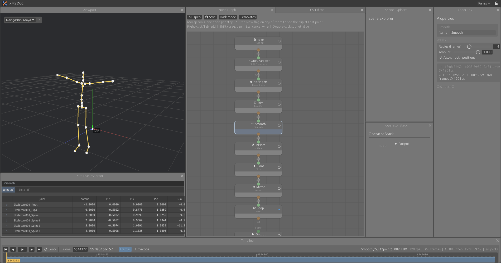

# Animation and mocap

Animation nodes are in the "Animation & Mocap" sub-menu of the add-node menu. A clip holds a skeleton, per-frame transforms, a rational frame rate and timecode, including drop-frame.

## Timeline

The timeline has no range of its own. It takes range, rate and timecode from the clip of the selected node. Space plays, Left and Right step a frame, Home and End jump to the ends.

## Nodes

| Node | What it does |
|---|---|
| Load FBX | Reads the hierarchy and one take from an FBX file, baked per frame, converted to Y-up metres |
| Load FBX Folder | One file out of a folder, picked by index or from a dropdown of file names |
| Test Clip | A generated clip for trying things out |
| Rename Joints | Renames joints. Find is a regular expression, picked from the joint list or typed. Replace may use `$1`, `$2` for its groups |
| Trim Clip | Cuts the clip to a range |
| Retime | Changes the frame rate |
| Set Timecode | Sets the start timecode |
| Split Characters | One output per character, by position or by root joint |
| Auto T-Pose | Rotations zeroed, root at the origin, optional hip height |
| Fix Pose | Manual rotation and position corrections. Each correction takes a joint pattern and applies to every joint it matches. An exact joint name applies to that joint only |
| Proxy Skin | A sphere per bone and a cylinder per link, bound to the skeleton |
| Write FBX | Binary FBX with skeleton, animation, mesh, skin and bind pose |

## Clip tools

In the "Mocap tools" section of the same sub-menu.

| Node | What it does |
|---|---|
| Mirror | Swaps left and right joints and mirrors the motion across X |
| Smooth | Averages rotations, and optionally translations, over a radius in frames |
| In Place | Removes horizontal travel of the root. Optionally keeps the height, or moves the travel to a root joint |
| Transform Clip | Moves, turns and scales the whole clip |
| Blend Clips | Plays the first clip, then the second, with a blend in frames. Can align the second clip to where the first ends |
| Loop | Blends the end of a clip into its start |
| Retarget | Puts the motion of the first input on the skeleton of the second. Joints are matched by name, ignoring prefixes and namespaces. Bones are aligned in the rest pose, so the two skeletons may rest differently |
| Time Warp | Changes speed, or reverses |
| Prune Joints | Removes joints whose names match a pattern, with everything below them |
| Floor | Moves the clip so its lowest point sits at a height |

Retarget copies rotations and root motion. It has no IK, so feet can slide when proportions differ.

## Choosing joints

Joint fields take patterns, described in [Interface](interface.md#name-patterns): comma-separated regular expressions with a picker of the joints coming in. For example `thumb, index, middle, ring, pinky` or `^Left.*(Arm|Hand)$`.

## Joints and bones

With a clip node selected, the Primitive Inspector shows a Joint tab (name, parent, position and rotation at the current frame) and a Bone tab (one row per bone: the joint it starts at, the joint it points to, and its length).

## Batch export

Write FBX writes the current file or every file of the folder, in the background. The Templates menu has "Mocap split", which builds the whole graph for splitting a two-character take into animation files and skinned T-pose files.

Every path field has a folder button that opens the file browser. It reopens in the last folder visited.

## Graphs

Open and Save in the node graph header read and write the graph as JSON. The contents of ICE subnets are not saved.

## Not done yet

Meshes and skinning read from FBX, timeline zoom and pan, curve cleanup, IK, foot planting, characterization. Import into Unreal has not been tested.
