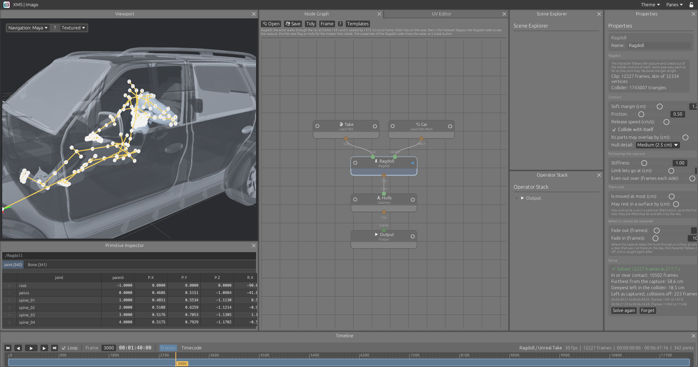

# Ragdoll: collision cleanup for motion capture

A captured performance does not know about the set. The actor sat on a box, the character sits in a car, and the hips are in the cushion, the feet under the floor and a forearm through a thigh. The Ragdoll node keeps the character out of a collider mesh and out of itself, and changes the capture as little as that takes.

## The three nodes

All three are under Animation & Mocap in the add menu.

| Node | Does |
|---|---|
| Load FBX Mesh | Reads every mesh of an FBX file, where it stands, as packed primitives. For the set. |
| Calamari | Cuts the skin into rigid pieces, one per body, or shows the convex hull of each piece. For looking at what will collide. |
| Ragdoll | First input a clip, second input a collider mesh. Puts out the clip, kept out of the collider. |

Load FBX now reads a mesh bound to the skeleton, with its weights, and the viewport draws it bending with the joints. Write FBX writes the weights back.

Any mesh can be the collider: a model from Load FBX Mesh or Load USD, a cube, anything the mesh nodes make. It does not have to be closed, one-sided or tidy.

## Using it

1. Load the take with **Load FBX** and the set with **Load FBX Mesh**. They must already be lined up: the node moves the character, not the set.
2. Wire the take to the first input of a **Ragdoll** node and the set to the second. Put the view flag on the Ragdoll node. The set is drawn see-through, with the character inside.
3. Press **Solve** in the properties of the node. A bar shows frames done, frames a second and time left. **Stop** stops it.
4. When it is done the node puts out the solved clip. Scrub it. Wire it on to Write FBX like any clip.

The node solves nothing by itself. Until Solve has run for exactly the clip, collider and settings it has, the clip passes through as it came, and the panel says so. Change a setting and the panel says "not solved" again.

## The template

**Ragdoll: into the car** is the take this was built on: an actor who walks through a car and sits in it for six minutes. It loads two files from `examples/ragdoll`:

| File | Size |
|---|---|
| `character_with_motion_and_mesh.fbx` | 205 MB |
| `car_for_collision.fbx` | 99 MB |

GitHub takes no file over 100 MB, so they are not in the repository and not in the downloads. Copy them into `examples/ragdoll`; Git ignores them there. Without them the template says where they go.

The result of solving that take with the default settings ships in `examples/ragdoll/solved`, 4 MB. With the two files in place the template opens solved, with no wait. Change a setting and it has to be solved again.

## What it does

**Bodies.** One rigid body per main bone, found by joint name: pelvis, spine, neck, head, upper arm, lower arm, hand, thigh, calf, foot. Unreal and MetaHuman names are known (`pelvis`, `spine_03`, `upperarm_l`, `calf_r`), and HumanIK and Mixamo names (`Hips`, `Spine1`, `LeftForeArm`, `RightUpLeg`). Skin on fingers, toes, collar bones, twist and helper joints goes to the body above. A part that comes out far lighter than the rest is not a body either.

**Hulls.** Each body gets the convex hull of its piece of skin: 42, 162 or 642 planes, by its size and the Hull detail setting. A body with no skin, such as the head of a body-only mesh, gets a capsule.

**Following.** Each body is carried along with the capture. With nothing in the way the result is the capture, exactly. A body that was pushed aside comes back at the release speed.

**Contact.** A body is pushed out of the collider no faster than the release speed, and starts being pushed, softly, a margin before it touches. The solver's changes are then evened out over a few frames each side, so a contact is taken up over about five frames and nothing flickers.

**Joints.** Each joint may leave the capture by so much swing and twist, by the part of the body: a spine little, a shoulder a lot. Elbows and knees bend about one axis, which is measured from the clip, and not past the straightest pose the clip holds. A hand, a foot or the head that is pushed keeps its turn: the limb moves, the hand does not spin.

**Itself.** Parts of the character are kept out of each other, beyond an allowed overlap. Neighbours along the skeleton and the parts of the trunk are left alone.

**No stretching.** The result is rotations on the same skeleton, and a position for the hips. Every other joint keeps its capture. Bone lengths cannot change.

## When it cannot be resolved

**Walking through the set.** Where the capture takes the trunk through a surface, its middle across one or more than half of it behind one, the character cannot be kept out. The solver sees this ahead of time. Collisions fade out before it, the character follows the capture through, and collisions fade in after. The panel lists these stretches with their timecode.

**Sunk deep.** The trunk is moved out of the collider by a set distance at most. Sunk deeper than that in the capture, it is moved that far and left in by the rest. A trunk sunk a little in a seat is lifted onto it. One sunk deep is not thrown across the car.

**A limb held too far.** A limb held further from its capture than the limit lets go: its collisions fade out, it returns to the capture, and takes hold again when the capture is clear.

**Anything else.** There is no gravity, no momentum and no stored energy. Each frame starts from the capture and is only pulled back toward it, so nothing can build up. A body whose state is not usable is put back on the capture.

## Long takes

A take is solved 128 frames at a time. For each chunk the capture is asked for those frames and the few after them that are needed to look ahead, the chunk is solved, written to a file, and dropped. The solver holds one chunk whatever the length of the take.

The file holds a rotation per body per frame: about 4 MB for 12,000 frames. It is kept in the cache folder (`~/.cache/xms/ragdoll` on Linux, `Library/Caches` on macOS, `%LOCALAPPDATA%` on Windows) under a name made from the clip, the collider and the settings, so a solve is found again in the next session. Set `XMS_CACHE_DIR` to keep it somewhere else. **Forget** removes it.

The program still holds a clip as a whole once it is loaded, and the solved clip beside it. That is how clips work here, not something the solver adds.

## Settings

| Setting | Default | Does |
|---|---|---|
| Soft margin | 1.2 cm | Distance from a surface at which pushing starts |
| Friction | 0.5 | How much a body pressed into a surface resists sliding along it |
| Release speed | 60 cm/s | How fast a body is pushed out, and how fast it comes back |
| Collide with itself | on | |
| Its parts may overlap by | 3 cm | Convex hulls are fatter than the skin. Less than this is not a collision |
| Hull detail | Medium | Spacing of the points on the hulls: 3.5, 2.5 or 1.8 cm |
| Stiffness | 1 | How firmly bodies hold to the capture |
| Limb lets go at | 45 cm | |
| Even out over | 2 frames each side | 0 turns it off |
| Trunk is moved at most | 12 cm | |
| Trunk may rest in a surface by | 0 cm | A seat gives under a sitter |
| Fade out, fade in | 6, 10 frames | Around a stretch the trunk passes through the set |

## Measured

On a take of 12,227 frames at 30 fps (a MetaHuman body, 342 joints, 32,334 vertices) against a car of 1,743,007 triangles, on two cores:

| | |
|---|---|
| Loading the take | 5 s |
| Building the triangle tree | 1 s |
| Solving | 278 s, 44 frames a second |
| In or near contact | 10,502 frames |
| Collisions off | 223 frames in two stretches: getting in and getting out |
| Bodies put back on the capture | 0 |

In the frames before the character reaches the car, the result is the capture to the last digit.

## A take of your own, from the command line

    XMS_RAGDOLL_CLIP=take.fbx XMS_RAGDOLL_SET=set.fbx cargo test real_take -- --ignored --nocapture

## Limits

- The character must be a human with joint names the node knows. Other skeletons are refused with a message.
- Hulls are convex. A hull bridges the hollow of a hand or the inside of an elbow.
- Hulls are made where the skin was bound and do not change: fingers collide as part of an open hand.
- A hull touches the collider at points spaced by the Hull detail setting. A part of the set thinner than that spacing can slip between them.
- A thin sheet with a free edge has no inside. A body that straddles the edge is judged by which side its joint is on.
- Lifting the hips onto a seat moves the whole character. If the set and the capture disagree by a hand's width, line them up first, or let the trunk rest in the seat.
- The floor is only a collider if it is in the collider mesh.
- No feet planting: a foot lifted onto a floor is not held still on it.
