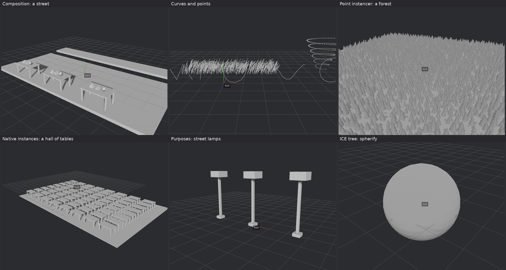

# Templates and example files

The Templates menu in the node graph header holds ready-made graphs. Picking one replaces the current graph; the + at the right of its name adds it to the current graph instead, beside the nodes already there (see [Interface](interface.md#files)). A line under the header then says what to look at.

The menu is in two parts, by whose work the templates show: **Martino** (composed USD stages, ICE) and **Simon** (everything else).

## Martino: USD stages

Each loads one stage from `examples/stage/` with Load USD. The Scene Explorer lists the stage; a closed prim is drawn as the box around what is below it until it is opened, or until Show all geometry is ticked.

| Template | Shows |
|---|---|
| Composition: a street | A stage from four files: the road and pavements from a sublayer, three tables referenced from `table.usda`, the shapes on them in the variant `cafe` of the variant set `dressing`, and an override in the root layer that moves the south pavement |
| Curves and points | BasisCurves of each basis (linear, Bezier, Catmull-Rom, a periodic B-spline), 600 strands of grass, and points whose width grows along a spiral |
| Point instancer: a forest | 4,900 pines and stones from one PointInstancer, each turned and scaled, drawn by GPU instancing. A Transform after it turns the forest by moving the placements; the three shared meshes are not copied |
| Native instances: a hall of tables | 64 instanceable references to `table.usda`: five meshes read once and placed 64 times |
| Purposes: street lamps | Three lamps, each with render geometry, a proxy of blocks and a guide (its cone of light as lines). The render, proxy and guide toggles of the Scene Explorer switch them |

## Martino: ICE

| Template | Shows |
|---|---|
| ICE tree: spherify | A cube subdivided three times, then an ICE tree: Normalize sets every point to unit length, Multiply scales by 1.2. Select the Spherify node and press the down arrow to go inside, the up arrow to come back |

## Simon: Basics

| Template | Shows |
|---|---|
| Primitives | Cube, sphere and grid, each moved with a Transform and joined with Merge |
| Scatter and copy | Scatter Points on a grid, a small cube copied onto each point with Copy To Points |
| ICE subnet | The same scatter and copy built inside a subnet. Double-click the subnet node, or select it and press ↓, to open it |
| USD import | Two USD files loaded with Load USD, one moved onto the other, merged |

## Simon: Modelling

| Template | Shows |
|---|---|
| Edit Poly: tower | Inset, extrude and bevel stacked on the top face of a cube, all live |
| Edit Poly: panels | By-polygon inset and extrude on every cell of a grid, a bevel on every other one |
| Edit Poly: goblet | Edge loops with Connect, a Transform, extrudes and Subdivide. The first three operations are collapsed |
| Edit Poly: bridge | Two cubes joined with Bridge. The selection is a box rule, so it follows changes upstream |
| Edit Poly: bolt | Chamfer, slice, hinge and the other newer operations on one cube |
| Edit Poly: sea mine | Eleven operations on one cube, with one round of subdivision at the start and two at the end: about 9,600 polygons. The hull is collapsed, the horns and ports are live |

## Simon: UV

| Template | Shows |
|---|---|
| Unwrap the sea mine | UV Unwrap on the sea mine, shown in the UV Editor |
| UDIM tiles | A body and two hands made of separate pieces, unwrapped over three tiles |
| Edit UV islands | A box unwrapped, the layout scaled with UV Transform, two islands moved with UV Edit |

## Simon: USD

| Template | Shows |
|---|---|
| USD: heavy model | A 461,595 triangle model as 43 packed primitives, with its materials, textures and UVs |
| USD: pick and edit | One wheel picked by a path pattern, moved, and handed to an Edit Poly node. The other primitives pass through |
| USD: prune | The model cut down to its wheels and callipers |

## Simon: Animation & Mocap

| Template | Shows |
|---|---|
| Clip basics | Test Clip, Rename Joints, Trim, Retime and Set Timecode in a chain. Select each node to see the timeline follow |
| FBX import | The example take loaded with Load FBX and trimmed by a second at each end |
| T-pose and export | Auto T-Pose, Fix Pose lowering the arms, Proxy Skin and Write FBX |
| Mocap tools | A character of the example take through the clip tool nodes |
| Retarget | A character of the example take driving the test skeleton, which rests in another pose |
| Body Collide: into the car | A captured actor walks through a car and sits in it, kept out of the seat, the floor and himself, within what a human body can do. A Characterize node shows which joint is which part. Opens solved. See [Body Collide](body-collide.md) |
| Mocap split (example takes) | The mocap split graph on the example folder: one take of two characters |
| Mocap split | The same graph with no folder set |

## Example files

In the `examples` folder:

| File | Content |
|---|---|
| `takes/S3_12point5_002.fbx` | A real motion capture take: two characters ("Skeleton 001" and "Skeleton 002"), 136 bones, 728 frames at 120 fps |
| `DeLorean.usdz` | A production-size model: 43 mesh prims, 461,595 triangles, 30 materials, 40 textures. By VTX (https://sketchfab.com/VTX_car), CC BY-NC-SA 4.0: no commercial use. See `examples/CREDITS.md` |
| `shapes.usda` | Three meshes: pyramid, prism, octahedron |
| `table.usda` | A table: a top and four legs, five meshes |
| `stage/street.usda`, `stage/street_base.usda` | A street: the base as a sublayer, references to `table.usda` and `shapes.usda`, a variant set, an override |
| `stage/strands.usda` | BasisCurves of each basis, grass strands, a Points prim with widths |
| `stage/forest.usda` | A PointInstancer of 4,900 copies of two prototypes |
| `stage/tables.usda` | 64 instanceable references to `table.usda` |
| `stage/lamps.usda` | Three lamps with render, proxy and guide purposes |

The FBX file holds skeletons and animation only, no meshes.

The program looks for the folder in this order: the folder named by the `XMS_EXAMPLES` environment variable, next to the program, the root of the source tree when run with `cargo run`, the working folder. If it is not found, the template still loads and its message says so.

The USD files are generated by the program. To make them again:

    cargo test write_example_files -- --ignored
