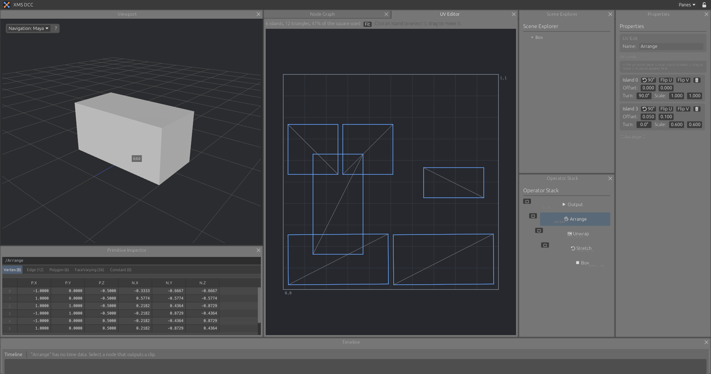

# UV

UV nodes are in the "UV" sub-menu of the add-node menu. UVs are stored per polygon corner.

## Nodes

| Node | What it does |
|---|---|
| UV Unwrap | Makes UVs for the incoming mesh |
| UV Transform | Offsets, turns and scales the whole layout |
| UV Edit | Holds a list of edits to single islands: offset, turn, scale, flip U, flip V |

### UV Unwrap

| Method | Result |
|---|---|
| Conformal | Charts are cut where neighbouring faces differ by more than Angle. Each chart is flattened with least squares conformal maps, turned to its smallest bounding box and packed in rows into the unit square, Margin apart |
| Box | Each face projected along the axis its normal is closest to |
| Planar | Everything projected along one axis |

The conformal method follows Lévy, Petitjean, Ray and Maillot, "Least Squares Conformal Maps for Automatic Texture Atlas Generation", 2002. The system is solved with conjugate gradients.

## UV Editor pane

A tab behind the Node Graph in the default layout. It draws the UVs of the selected node, with seams marked, and reports islands, triangles and how much of the unit square is used.

| To | Do this |
|---|---|
| Zoom | Scroll |
| Pan | Drag with the middle button |
| See everything | Fit |
| Select an island | Click it, with a UV Edit node selected |
| Move an island | Drag it. The values appear in the properties of the UV Edit node |

## Not done yet

- Editing single UV vertices and edges, sewing and cutting seams by hand
- A checker texture in the viewport
- UVs through Edit Poly, Copy To Points and Scatter. Transform and Merge keep them
- UVs read from or written to FBX and USD
- ABF++, SLIM and BFF. Charts with strong curvature stretch under LSCM
- Packing is by rows, not tight
