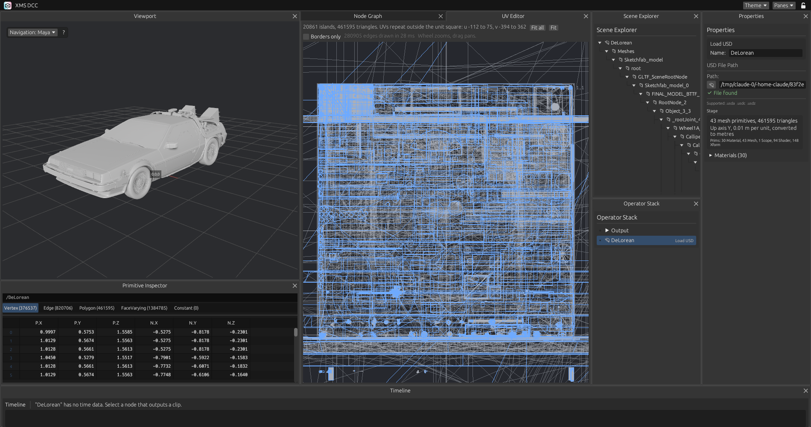

# UV

UV nodes are in the "UV" sub-menu of the add-node menu. UVs are stored per polygon corner.

## Nodes

| Node | What it does |
|---|---|
| UV Unwrap | Makes UVs for the incoming mesh |
| UV Transform | Offsets, turns and scales the whole layout |
| UV Edit | Holds a list of edits to single islands: offset, turn, scale, flip U, flip V |

### UV Unwrap

| Method | Result |
|---|---|
| Conformal | Charts are cut where neighbouring faces differ by more than Angle. Each chart is flattened with least squares conformal maps, turned to its smallest bounding box and packed in rows into the unit square, Margin apart |
| Box | Each face projected along the axis its normal is closest to |
| Planar | Everything projected along one axis |

The conformal method follows Lévy, Petitjean, Ray and Maillot, "Least Squares Conformal Maps for Automatic Texture Atlas Generation", 2002. The system is solved with conjugate gradients.

### UDIM tiles

"UDIM tiles" on the UV Unwrap node spreads the mesh over that many tiles, numbered 1001 upwards, ten to a row. One tile keeps everything in the unit square.

What is spread is the elements of the mesh: its separate pieces, not its UV islands. An element is never split between tiles.

1. Each element is measured by its surface area.
2. Elements that sit close together are grouped. Groups merge nearest first, by the gap between their bounding boxes, with a penalty for a group that grows past its share of the total surface. Merging stops when there is one group per tile.
3. The groups take the tiles in order of surface: the one with the most goes to 1001, the smallest to the last tile.
4. Each tile is packed on its own, so it is filled whatever the size of what is in it.

So a palm and its fingers, modelled as separate pieces, land on one tile together, and small loose parts end up on the last tiles. With fewer elements than tiles, each element has a tile to itself and the rest stay empty. A mesh in one piece stays on 1001.

Past 256 elements, the smallest ones skip the grouping and join the nearest of the 256 largest.

## UV Editor pane

A tab behind the Viewport in the default layout. It draws the UVs of the selected node, with seams marked, and reports islands, triangles, tiles and how much of them is used. Every tile in use is drawn with its UDIM number, and the view fits them when the set of tiles changes.

| To | Do this |
|---|---|
| Zoom | Scroll |
| Pan | Drag with the middle button |
| See every tile in use | Fit, or F |
| Select an island | Click it, with a UV Edit node selected |
| Move an island | Drag it. The values appear in the properties of the UV Edit node |

## Heavy layouts

The editor draws the layout into a pixel buffer of its own, on several threads, and shows it as one image. It is redrawn only when the view, the layout or an option changes, so a still view costs nothing. There is no limit on the number of edges. The header shows the edge count and the time the last redraw took once a layout passes 100,000 edges.

"Borders only" draws the outline of each island and leaves out the edges inside. It turns itself on for layouts over 300,000 edges, and can be turned off again. Where many inner edges land on one pixel they add up, so density reads as tone.

UVs that run far outside the unit square, as a repeating texture does, are not taken for UDIM tiles: the header gives their extent, Fit shows the unit square and "Fit all" the whole extent.

The canvas is built as a stack of layers composed into that image. The wireframe is the only layer today.

## Not done yet

- Editing single UV vertices and edges, sewing and cutting seams by hand
- A checker texture in the viewport
- UVs through Edit Poly, Copy To Points and Scatter. Transform and Merge keep them
- UVs read from FBX, and written to FBX or USD. UVs are read from USD
- ABF++, SLIM and BFF. Charts with strong curvature stretch under LSCM
- Packing is by rows, not tight
- Texel density is even inside a tile, not between tiles
- Choosing by hand which element goes on which tile
